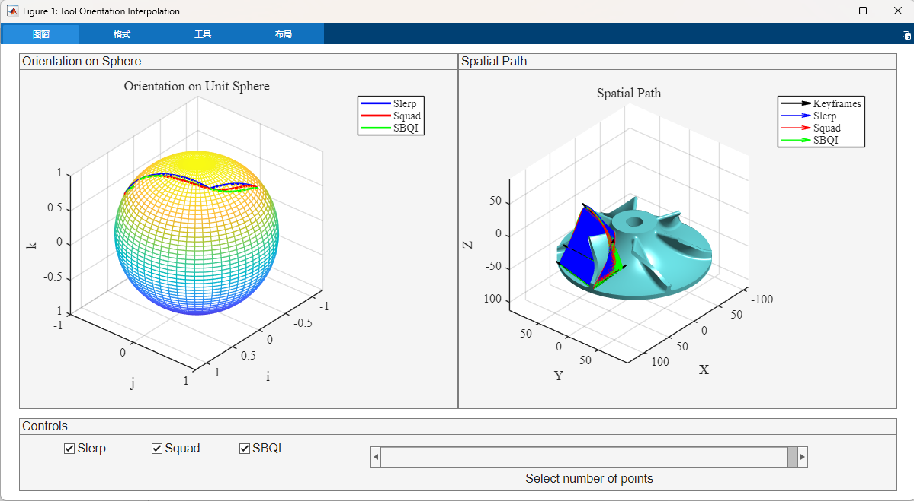

# Smooth Bspline-based Quaternion Interpolation for Tool Orientation

MATLAB implementation of quaternion interpolation methods for smooth tool orientation in CNC machining and robotics applications.


*Comparison of Slerp, Squad, and SBQI interpolation methods on impeller test case*

## Features

- **Three Interpolation Methods**: 
  - Slerp (Spherical Linear Interpolation)
  - Squad (Spherical Quadrangle Interpolation)  
  - SBQI (Spline-Based Quaternion Interpolation)
- **Interactive Visualization**: Slider-based tool for exploring interpolation results

## Quick Start

1. Clone the repository and add to MATLAB path:
```matlab
addpath(genpath('/path/to/project'));
```

2. Run the main function:
```matlab
mainFunc;
```

3. Select different test cases in `mainFunc.m`:
```matlab
% Choose one of the following:
load('caseTwoKeyframes.mat');    % Simple two-keyframe case
load('caseImpeller.mat');        % Impeller machining  
load('caseSurfObs.mat');         % Surface with obstacles
load('caseBlade.mat');           % Blade processing
```

## Project Structure

- `mainFunc.m` - Main demonstration script
- `generateToolOrientationBySlerp/Squad/SBQI.m` - Interpolation implementations
- `centripetalParameterization.m` - Curve parameterization
- `plotToolOrientationInterpolationWithSlider.m` - Visualization module
- `case*.mat` - Test case data files

## Our paper

SBQI: A Smooth B-Spline-Based Quaternion Interpolation Method for $C^3$-Continuous Tool Orientation Planning in 5-Axis CNC Machining

## License

GNU General Public License v3.0 - see [LICENSE](LICENSE) for details.

## Author

**Lei Wu** - Dalian University of Technology
```
